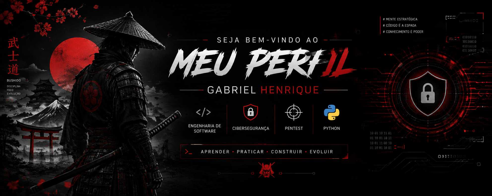

<h1 align="center">Gabriel Henrique</h1>

   Engenharia de Software •  Cibersegurança •  Pentest •  Python

---

---

##  Sobre mim

Sou estudante de **Engenharia de Software**, com foco no desenvolvimento da minha primeira carreira na **Programação** e interesse especial em **Pentest**.

Atualmente, estou desenvolvendo meus conhecimentos em **Python, Redes, Linux e Segurança Web**, buscando aplicar o aprendizado em projetos, estudos e laboratórios autorizados.

Meu objetivo é conquistar minha **primeira oportunidade profissional na área da Programação**, adquirindo experiência e evoluindo continuamente como profissional.

---

##  Objetivo Profissional

• Aprofundar meus conhecimentos em **Pentest**

• Evoluir no desenvolvimento com **Python**

• Aprimorar conhecimentos em **Redes e Segurança Web**

---

##  Conhecimentos

### 🌐 Redes
`TCP/IP` `TCP/UDP` `DNS` `HTTP/HTTPS` `Portas` `NAT`

### 🐍 Linux
`Terminal` `Permissões` `Processos` `Arquivos e Diretórios`

### 🪟 Windows
`CMD` `PowerShell` `Usuários` `Permissões` `Serviços` `Processos`

### 💻 Programação
`Python` `Lógica de Programação`

### 🕸️ Web
`HTTP` `Cookies` `Sessões` `Headers` `APIs`

### 🛡️ Cibersegurança
`Vulnerabilidades` `Autenticação` `Autorização` `Hash` `Criptografia`

### 🧠 Reconhecimento
`Hosts` `Serviços` `Portas` `Tecnologias`

### 🔐 Segurança Web
`SQL Injection` `XSS` `CSRF` `Controle de Acesso`

> → Estudos e práticas de segurança realizados exclusivamente em ambientes próprios, laboratórios ou sistemas devidamente autorizados.

---

## Tecnologias e Ferramentas

  

**Python • Linux • Windows • Git • GitHub • VS Code**

---

## Atualmente estudando

| Área | Estudos |
|---|---|
|  **Programação** | Python • Lógica de Programação |
|  **Cibersegurança** | Pentest • Segurança Web |
|  **Redes** | TCP/IP • DNS • HTTP/HTTPS |
|  **Sistemas** | Linux • Windows |
|  **Graduação** | Engenharia de Software |

---

##  Projetos

Meu portfólio está em desenvolvimento.

Este GitHub será utilizado para documentar minha evolução e publicar projetos relacionados a:

**↳ Python • ↳ Cibersegurança • ↳ Pentest • ↳ Redes • ↳ Segurança Web • ↳ Engenharia de Software**

> ⚠️ Novos projetos serão adicionados conforme avanço nos estudos e desenvolvo novas habilidades.

---

##  GitHub

---

##  Contato

### Gabriel Henrique

 **Engenharia de Software**  
 **Cibersegurança**  
 **Pentester iniciante**  
 **Python**  
🇧🇷 **Brasil**

 

**Aberto a conexões, aprendizado e oportunidades profissionais na área de Cibersegurança.**

---

###  Aprender • Praticar • Construir • Evoluir

**Obrigado por visitar meu perfil!**

